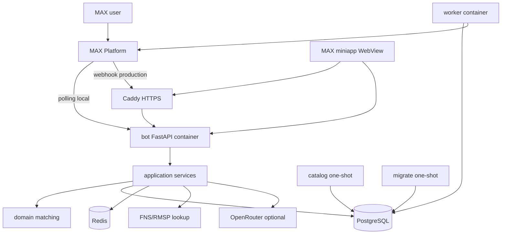
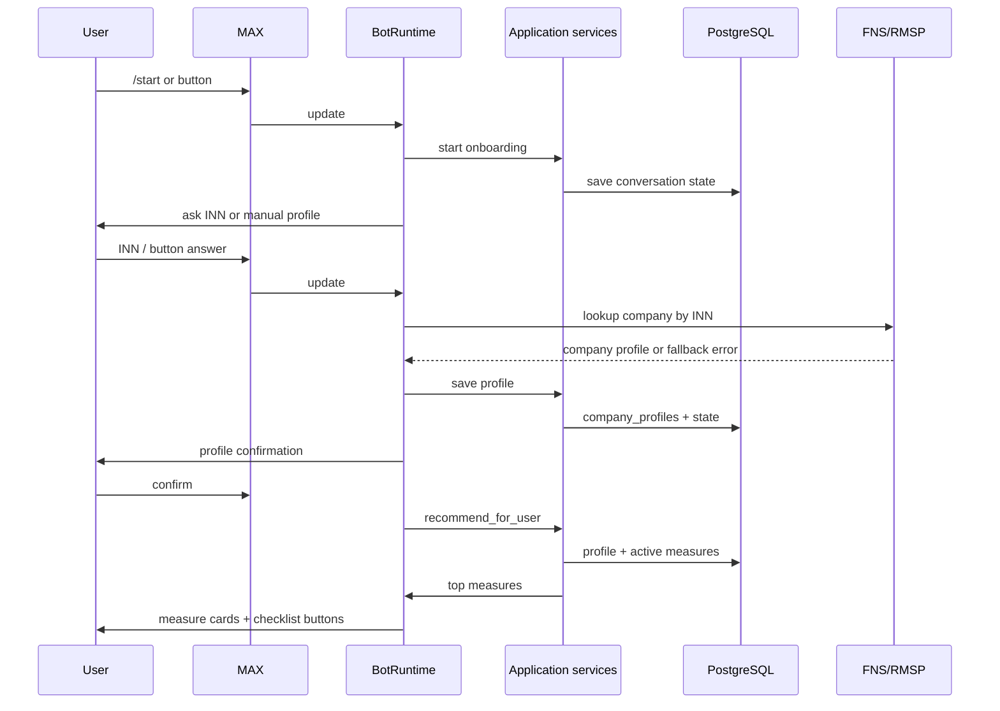
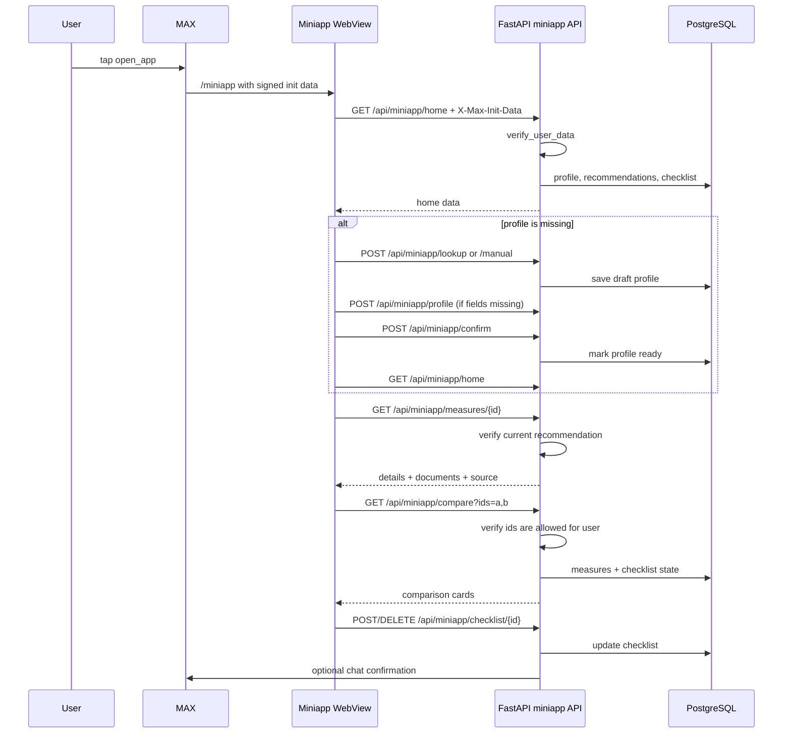

# Архитектура

Проект устроен как modular monolith: один backend обслуживает MAX-бота,
webhook, health endpoints и static miniapp. Отдельный worker отправляет
напоминания. PostgreSQL хранит бизнес-данные, Redis хранит короткоживущую
операционную информацию.

## Контейнеры



Сервисы Compose:

| Сервис | Роль |
| --- | --- |
| `postgres` | Основное хранилище |
| `redis` | Idempotency/cache/rate limit |
| `migrate` | `alembic upgrade head` |
| `catalog` | Импорт справочников и каталога мер |
| `bot` | FastAPI, MAX polling/webhook, miniapp API |
| `worker` | Напоминания по чек-листам |
| `caddy` | HTTPS reverse proxy в production |

## Слои кода

```text
presentation -> application -> domain
                 application -> ports
infrastructure implements ports
```

| Слой | Папка | Ответственность |
| --- | --- | --- |
| Presentation | `src/navigator/presentation` | MAX update parsing, buttons, renderers, HTTP routes |
| Application | `src/navigator/application` | Use cases: onboarding, profiles, recommendations, checklists |
| Domain | `src/navigator/domain` | Entities, enums, matching rules, INN validation |
| Ports | `src/navigator/ports` | Interfaces for MAX, FNS, repositories, clock |
| Infrastructure | `src/navigator/infrastructure` | SQLAlchemy, Redis, MAX API client, FNS adapters, OpenRouter |
| Entrypoints | `src/navigator/bootstrap.py` | FastAPI app, lifespan, webhook, worker loop |

Presentation code keeps SQL behind repository bundles. `BotRuntime` owns the
runtime adapters it needs for MAX replies and FNS lookup, while business rules
stay in application services and domain functions.

## Bot flow



`BotRuntime` принимает normalized `Incoming`: текст, callback payload и callback
id. Callback payload парсится в `callbacks.py`; неизвестные payload
acknowledge-ятся и игнорируются.

Основные состояния профиля:

- `AWAITING_INN`
- `MANUAL_REGION`
- `MANUAL_BUSINESS_FORM`
- `MANUAL_SPHERE`
- `MANUAL_STAGE`
- `MANUAL_EMPLOYEES`
- `CONFIRM_PROFILE`
- `READY`

Если профиль неполный, `RecommendationService` возвращает `ProfileIncomplete`,
и бот просит дозаполнить данные. Если профиль полный, matching возвращает до
трех мер по умолчанию.

## Matching

Matching живет в `src/navigator/domain/matching.py`.

Алгоритм:

1. Берет только активные меры, у которых `valid_from` уже наступил, а
   `application_deadline` не истек.
2. Проверяет ограничения меры: регион, сфера, форма бизнеса, стадия, статус МСП.
3. Проверяет диапазон сотрудников через точное `employee_count` или bucket.
4. Делит результаты на `ELIGIBLE`, `NEEDS_MORE_INFO`, `INELIGIBLE`.
5. Сортирует подходящие меры по priority, max amount, deadline и имени.
6. Возвращает сначала `ELIGIBLE`, затем `NEEDS_MORE_INFO`.

Пустое ограничение в CSV означает "для всех".

## Miniapp flow



Security rules:

- API requires `X-Max-Init-Data`.
- `verify_user_data` checks HMAC signature with `MAX_BOT_TOKEN`.
- `auth_date` must be within the accepted time window.
- Home launch can compare any two current recommended measures for the user.
- Direct comparison launch binds access to the signed pair from
  `start_param=compare_<uuid>_<uuid>`.
- Requested measure ids must be among current recommendations for the user.
- Checklist changes are allowed only for measures visible in the current launch.

Static page: `front/compare-card-screens.html`.

## Webhook and polling

Local mode uses polling when `MAX_TRANSPORT=polling`. `lifespan()` starts
`polling_loop`, which reads `get_updates`, stores the marker and processes each
update sequentially.

Production mode uses:

- `POST /webhook/max`
- `POST /webhooks/max`

Webhook authentication:

- Header: `X-Max-Bot-Api-Secret`
- Expected value: `MAX_WEBHOOK_SECRET`

Idempotency:

- Event id comes from `update_id`, `id` or a SHA-256 hash of the update body.
- Redis key prefix: `max-update`
- Duplicate delivery returns `{"status": "duplicate"}`.
- If processing raises, idempotency key is released so MAX can retry.

## Database

Alembic owns schema changes. Current initial migration creates:

- users and conversation states;
- company profiles;
- regions, sphere categories, OKVED mapping;
- measures and measure filters;
- measure documents;
- user checklists and document states;
- feedback;
- investor leads;
- usage counters;
- analytics events;
- reminder deliveries;
- courses.

PostgreSQL is the source of truth. Redis loss must not delete profiles,
checklists, measures, feedback, analytics or conversation state.

## Data import

`navigator.infrastructure.data.seed` imports:

1. `sphere_categories.csv`
2. `okved_mapping.csv`
3. `measures.example.csv` only outside `APP_ENV=production`
4. `measures.current.csv`
5. `courses.example.csv`

`navigator.infrastructure.data.import_measures` validates required CSV columns,
enum values, regions, dates, URLs, booleans, numbers and duplicate
`external_code`.

Production behavior deliberately disables stale demo measures by setting
`is_active=false` for demo records.

## External integrations

| Integration | Implementation | Notes |
| --- | --- | --- |
| MAX API | `infrastructure/max_api` | Raw `Authorization: <MAX_BOT_TOKEN>` |
| FNS/RMSP | `infrastructure/fns` | `rmsp_portal`, `local_snapshot`, `mock` |
| OpenRouter | `infrastructure/openrouter` | Optional explanation fallback, disabled by default |
| Caddy | `docker/Caddyfile` | TLS, reverse proxy, security headers |

Health checks intentionally verify only PostgreSQL and Redis. They do not call
MAX, FNS or OpenRouter, so external outages do not mark the container unhealthy.

## Production boundaries

`compose.prod.yml` changes local behavior:

- `APP_ENV=production`
- `MAX_TRANSPORT=webhook`
- no published PostgreSQL/Redis ports;
- Caddy publishes ports `80` and `443`;
- `bot` runs uvicorn with `${UVICORN_WORKERS:-2}`;
- `worker` enables reminders by default.

`scripts/production-setup.sh` is the supported bootstrap path for a fresh VPS.
It refuses to overwrite existing `.env`; for an existing deployment edit `.env`
manually and use Docker Compose directly.

## Design constraints

- Eligibility must stay deterministic; LLM output may explain, not decide.
- Manual profile flow must work even when FNS lookup fails.
- One-time MAX inline keyboards should be acknowledged/closed after taps to
  avoid repeated callback loops.
- Miniapp API must trust only signed MAX init data.
- New measures should enter through CSV validation before import.
