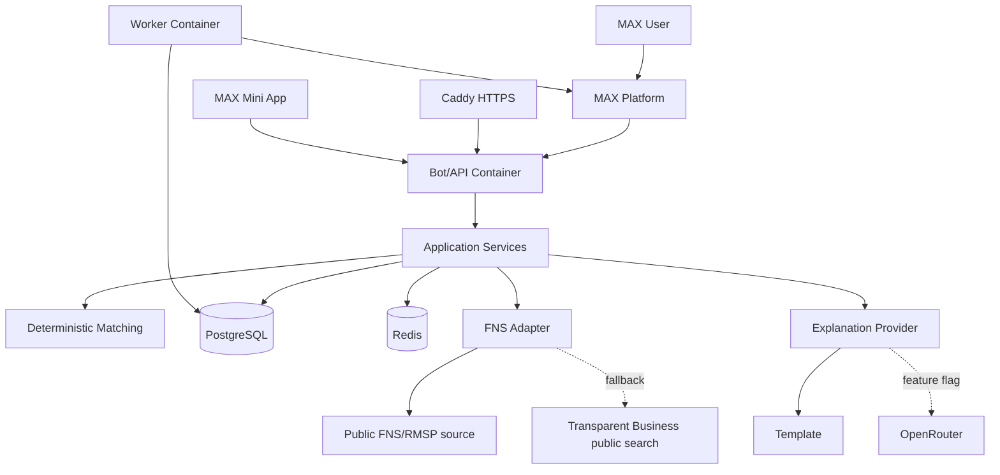

# Навигатор льгот и субсидий

Bot-first MVP for MAX: a small-business owner answers a short dialog, gets 1-3 suitable support measures, saves one to a checklist, and tracks documents later.

The optional mini-app compares two measures selected by the bot and uses the same checklist.



## Quick Start

```bash
cp .env.example .env
docker compose up -d --build
make seed-demo
curl http://localhost:8000/health/live
curl http://localhost:8000/health/ready
```

Local compose starts PostgreSQL, Redis, migrations, the API/bot, and the reminder worker. MAX polling is configured through `MAX_TRANSPORT=polling`; real MAX calls require `MAX_BOT_TOKEN`. For local Python checks, run `uv sync --extra dev` once.

The mini-app entry is `/miniapp` (the older `/miniapp/compare` URL remains available). Publish `/miniapp` over HTTPS, attach that URL to the existing bot in the MAX partner settings, and choose the native **Старт** launch button. Then set `MINIAPP_ENABLED=true` and `MINIAPP_COMPARE_URL=https://your-host/miniapp` (the variable name is retained for compatibility). `/start` sends a single mini-app entry when integration is enabled; MAX does not document automatic WebView opening from a bot command. The same page shows the home menu on a normal launch and comparison for a signed `compare_...` launch. Profile data is available only with signed MAX Bridge init data. Without a public HTTPS URL and partner registration, keep the feature disabled and use the chat flow.

## Commands

- `make build`, `make up`, `make down`, `make restart`, `make logs`, `make ps` wrap Compose.
- `make migrate` runs Alembic.
- `make lint`, `make format`, `make typecheck`, `make test` run local quality checks.
- `make seed-demo` loads the included demo catalogue; `make validate-data` and `make import-data` validate/import a curated CSV.
- `make max-smoke` checks the configured MAX token; `make webhook-register`, `make webhook-list`, and `make webhook-delete` manage subscriptions.

## Environment

Secrets live only in `.env` or deployment secret storage. `.env.example` contains placeholders for PostgreSQL, Redis, MAX, FNS, OpenRouter, mini-app, reminders, and debug toggles.

OpenRouter is off by default and must never decide eligibility. Measures and courses are manually curated data, not a live МСП.РФ API. The included 29-measure catalogue is synthetic MVP data from `table1.xlsx`: it demonstrates the selection flow and must be replaced or independently verified before production. FNS is best-effort profile enrichment with a manual dialog fallback.

## External Contracts

- MAX API base URL is `https://platform-api2.max.ru`. Requests use raw `Authorization: <MAX_BOT_TOKEN>`, never token query parameters.
- MAX webhook requests are authenticated with `X-Max-Bot-Api-Secret`. The webhook handler must respond `200` within 30 seconds; duplicate delivery must return `200` without repeated side effects.
- FNS enrichment checks the official SME register at `https://www.nalog.gov.ru/opendata/7707329152-rsmp/` first, then the public Transparent Business search as a best-effort fallback for entities outside the SME register. There is no documented official per-INN REST API in scope.
- Any internal `search-proc.json` endpoint is best-effort only; the product must keep manual fallback.
- OpenRouter uses `/api/v1/chat/completions` with Bearer auth, provider `ZDR`, and data collection disabled; it remains disabled by default.

## Migrations

Alembic owns schema changes:

```bash
docker compose run --rm migrate
```

The initial migration creates all core persistence tables from the specification.

## Production

Production combines local and prod files:

```bash
docker compose -f compose.yml -f compose.prod.yml up -d --build
```

`compose.prod.yml` switches MAX to webhook mode, adds Caddy, and does not publish PostgreSQL or Redis ports. Fill `MAX_WEBHOOK_PUBLIC_URL`, `MAX_WEBHOOK_SECRET`, and real secrets before deploy.

For the configured VPS, create an A record for `svadba-2026.ru` pointing to `193.5.251.40`, clone this repository, then run as `root`:

```bash
git clone https://github.com/LaimOr127/HaK_Max_bot.git benefit-navigator
cd benefit-navigator
./scripts/production-setup.sh
```

The script securely prompts only for `MAX_BOT_TOKEN` and `CADDY_EMAIL`, generates all other runtime secrets in the ignored `.env`, starts production Compose, checks HTTPS health, verifies the MAX token, and registers the webhook.

## Known Limitations

The bot path is implemented: onboarding, deterministic recommendations, details, checklists, feedback, investor lead capture, webhook/polling transport, idempotency, import, and reminders. The supplied support catalogue is synthetic, so results are not a legal eligibility decision and must be checked at the linked source. The mini-app API and page are wired locally, but opening it from MAX additionally requires a registered public HTTPS URL.
